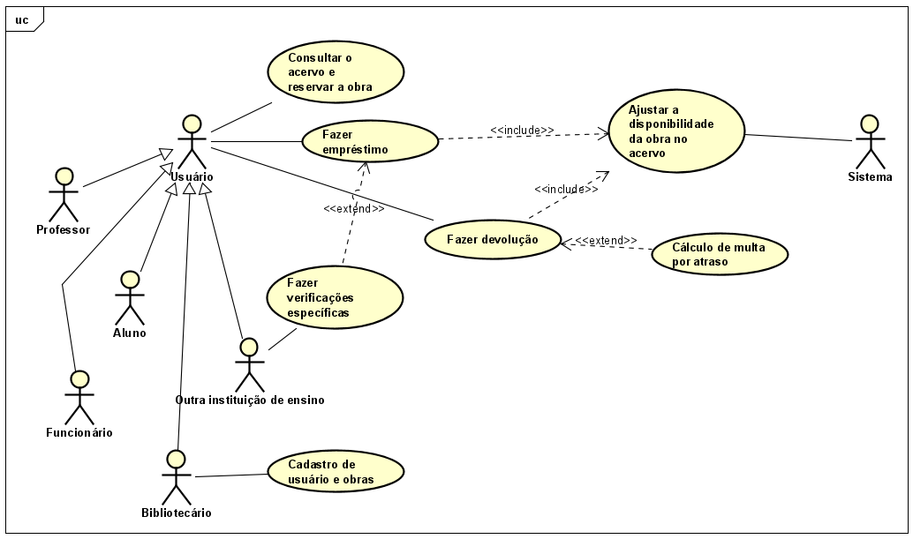

# Aula 2 (08-08)

1 - nivelamento casos de uso e classes
2 - introdução a projeto
3 - arquitetura de software

## UML - Diagrama de classes 

Classe é uma descrição de um tipo de objeto (ex: pessoa), é usada para classificar (agrupar) os objetos (semelhantes) que identificamos no mundo real. Quanto mais atributos, há maior granularidade.

Classes: 

* atributos (características)
* métodos (operações, funcionalidades)

-> visibilidade

O diagrama de classes demonstra a estrutura estática das classes onde são representados objetos do mundo real que são gerenciados pelo sistema.

Representa atributos, métodos e relacionamentos. 

### Visibilidades

Protected (#): classes que herdam de outra ou classes que estão no mesmo pacote podem acessar. 

Privada (-)

Pública (+)

### Relacionamentos

Associação: representa por meio de uma linha que liga duas classes. 

Generalização (herança): Quando há a necessidade de criar uma classe que herde os atributos e métodos de outra classe bem como os relacionamentos da classe superior.

Composição: Representa uma relação todo-parte. Na composição existe um forte relacionamento em que a parte não existe sem o todo.

Agregação: Representa uma relação todo-parte. Nessa relação, a perda do todo não resulta na perda das partes, ou seja, ambas as classes podem existir sem a existência da outra. Sua sintaxe é uma linha com um losango branco que corresponde ao todo.

### Exercício de fixação

1 - Caso de uso:

