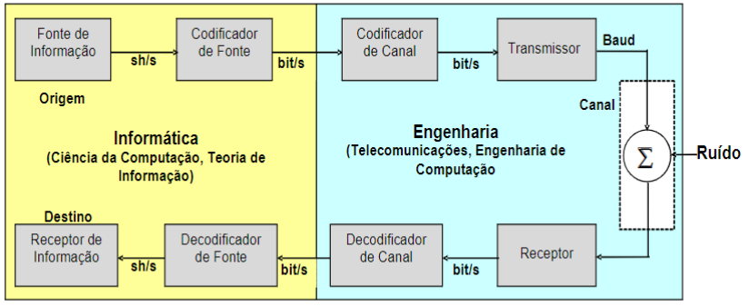
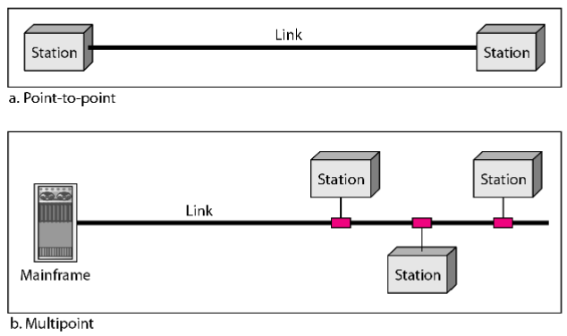

# Aula 2 (08-08)

## Introdução a Redes

### Modelo Cliente Servidor

Comunicação hierárquica. 

Servidores com hardware diferenciado e com centralização de serviços (NUTANIX - servidores para ter disponibilidade total, ex: durante um ano ele para somente 5 minutos).

Os clientes fazem solicitações aos servidores através de requisições pela rede. 

Existe servidores web monolíticos, containers (aumenta escalabilidade do acesso dos clientes), porém há o problema de falha do servidor onde pode ocorrer rompimento de cabo de fibra óptica, acabar a luz, desligar o servidor, etc.

Este modelo tem um acesso mais fácil, contudo enfrenta o problema de gargalo (caso ele pare, há perda de serviço). É o mais usado pra aplicações.

### P2P - Modelo Peer to Peer**

Não há servidor central, um exemplo é o torrent. Usuários são clientes e servidores, podendo atuar como ambos ao mesmo tempo e há uma comunicação não hierárquica.

O problema está na localização da informação desejada. Nessa rede, precisa-se descobrir os endereços dos pares. Cria-se uma rede entrelaçada, portanto, há alta escalabilidade e, caso seja uma rede muito grande, não ocorre gargalo.

Blockchain usa P2P.

## Elementos de um sistema de comunicação 

obs: o ruído não pode ser maior do que o sinal. no codificador de fonte, o protocolo TCP espera a confirmação de que o sinal chegou; caso não tenha chego, ele retransmite o sinal. 

O protocolo TCP estabelece uma conexão e mede a distância da conexão para usá-la como parâmetro. 

### Ponto a ponto e multiponto

Na rede ponto a ponto não há competição pelo canal. É usada a longa distância. 

Em multiponto, há uma competição no canal e pode ocorrer colisão. Caso haja, cada estação espera um tempo determinado até que o canal torne-se ocioso novamente. 

Caso o pacote for enviado para a última estação, todas o recebem, contudo somente a última, a quem foi enviado o pacote, poderá processá-la. 

Só funciona em uma distância pequena com poucas máquinas, usado comumente em redes locais. 

É chamada de rede probabilística. 

Também é possível classificar as redes pelo seu alcance.

Bus - Barramento - se um cabo pifar, a rede toda falha. 

Ring - rede antiga da IBM onde não havia colisão, mas não foi muito pra frente. 

Star - é usado no switch (visto na última aula). O problema é o central pifar.

Extended Star - há mais derivação para evitar sobrecarga. E o meio também pode ser um ponto de gargalo. 

Hierarchical - derivação da estrela extendida.

Mesh - mais caro e todos ligados juntos. 

Modelo de camadas da CISCO - Existe camada de acesso (com switches mais baratos), camada de distribuição, camada CORE. 

microondas man ou wan para fazer backbone.**

internet - rede de rede de redes.

no desenho, cada pontinho é uma man (do provedor). 

### Hierarquia de protocolos

Protocolo é um conjunto de regras para transmitir dados.
Request - Reply. 